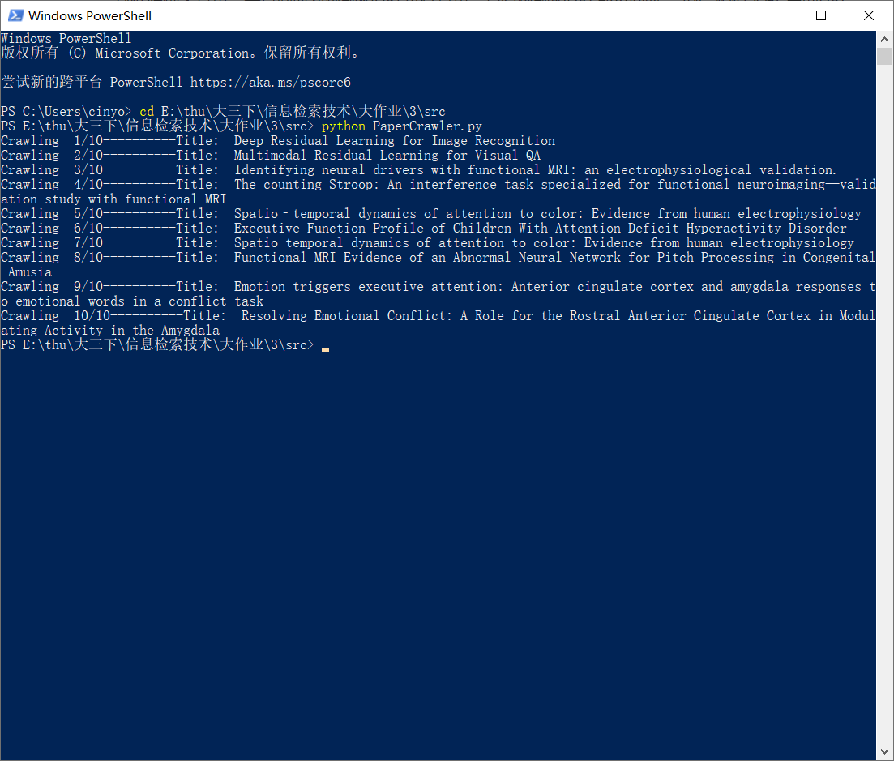
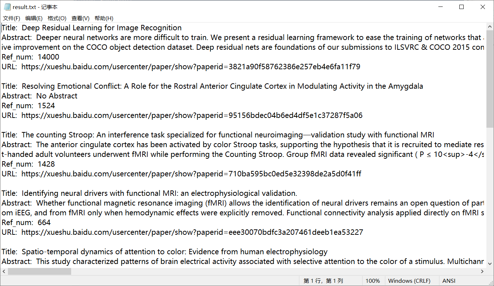

# 信息检索技术 第三次大作业

## 运行环境

* Python 3
* Windows 10
* selenium 3.141.0
* bs4 4.6.3

## 运行方式

1. 需要安装**selenium**和**bs4**：
   
   `pip install selenium bs4`
   
   并且安装Chrome的驱动，可参考https://blog.csdn.net/su_2018/article/details/100127223

2. **运行：**
   
   `python PaperCrawler.py`

   **命令行参数：**
   "-d", "--max-depth", type=int, default=5, help="max_depth"
   "-t", "--tot-papers", type=int, default=10, help="tot_papers"
   "-w", "--wait-time", type=int, default=2, help="wait_time"
   "-i", "--init-url", type=str, default="https://xueshu.baidu.com/usercenter/paper/show?paperid=3821a90f58762386e257eb4e6fa11f79"

## 文件结构

* ```PaperCrawler.py```——程序文件
* ```result.txt```——爬虫结果文件

## 已实现功能

本次爬虫选择的是爬取[百度学术](https://xueshu.baidu.com/)上的信息领域的论文，起始页面为[Deep Residual Learning for Image Recognition](https://xueshu.baidu.com/usercenter/paper/show?paperid=3821a90f58762386e257eb4e6fa11f79)，我们最后会把爬到的每篇论文的标题、URL、被引量、摘要保存在一个txt文件里。

* 基本项：爬取一个自己专业领域网站的站点信息，给出爬取过程中以下问题（一些简单的基本问题）的解决方案并实现。

  * **网页抓全，区分明网暗网，新站发现。**

    我们通过每个论文页面的“相似文献”中的链接，来发现新的网站。

    按理来说选择“引证文献”效果更好，曾经尝试过使用selenium模拟点击后，用bs4解析得到的html，但是发现得到的html中丢失了这部分的信息，这应该跟网页是动态加载有关，如果非要得到这部分信息的话可以选择用re来匹配，但是比较麻烦，因此选择了更简单但效果差不多的“相似文献”。

  * **网页抓新，网页更新或者消亡后及时更新，减少死链率以及提高实时性。**

    这里因为源网页是百度运营的，因此死链率极小，目前为止没碰到过。至于实时性，由于网页的更新或者消亡我们是无法被通知的，因此只能通过每隔一段时间重新运行一次程序来保障。

  * **网页下载流速限制，避免将网页抓死。**

    这里没有对下载流速进行限制，但为了将网页抓死，我们在抓取网页时加了2秒的等待时间，一方面是为了防止过快的请求被封ip，另一方面是由于这个页面貌似有ajax的异步请求，导致有时候我们需要的信息还没有加载完全，就已经开始bs4的解析，导致找不到信息，因此充分等待后我们再解析，就算由于有时候网速太慢导致还是没加载出来的话，也有try...except语句来保障程序的正常进行。

  * **网页避免重复抓取，更新链接时最近抓取过的网页不需要重复抓取。**

    在爬取的过程中，发现有很多相同的论文有不一样的URL，为了避免重复抓取，我们用了python里的set数据结构来查重，并且同时对标题和URL进行查重，只有标题和URL都不同时，才把“相似文献”中的URL放入候选池中。

    此外，同一篇论文的标题有时候字符会稍有不同，因此我们选择将标题中的特殊字符和空格等都去掉再进行对比。

  * **网页抓取深度控制，避免单个网页过分抓取。**

    因为想抓取的是信息领域的论文，如果抓取的深度太大，会与我们的主题偏差很大。因此我们会对每一个URL的深度进行标记，如果深度超过阈值，就不再往下爬取。

  * **网页抓取的优先级，网页的不同链接需要有不同的优先级，需要判断优先级进行抓取。**

    因为被引量越高的论文更重要，所以这里我们的优先级设定为论文的被引量，在侯选池中，每次会将被引量最大的网页弹出，用于爬取。

    这里侯选池我们使用的数据结构是大顶堆，实现使用的是python中的heapq库。

  * **镜像网页剔除，不同域名，相同内容的网页不需要重复抓取。**

    与上面的说明类似，同时对标题和URL进行查重，防止相同论文不同网页的爬取。

##  算法说明

细节在上面说得比较清楚了，大致的流程就是：从初始页面开始，解析当前页面，得到当前页面的论文信息，然后在“相似文献”中得到新的页面的链接，如果深度不超过阈值，则将它们加入侯选池中。解析完当前页面后，从侯选池中选择优先级最大的链接，重复上述步骤，直到得到的论文数达到要求。

## 实验结果

爬取10篇论文，得到以下结果：





结果还是比较令人满意的，达到了我们的目标。
